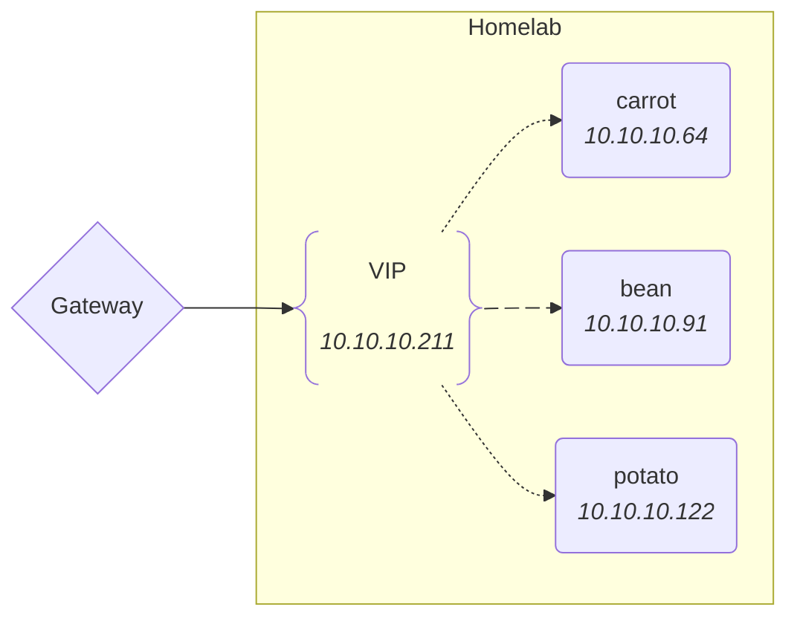
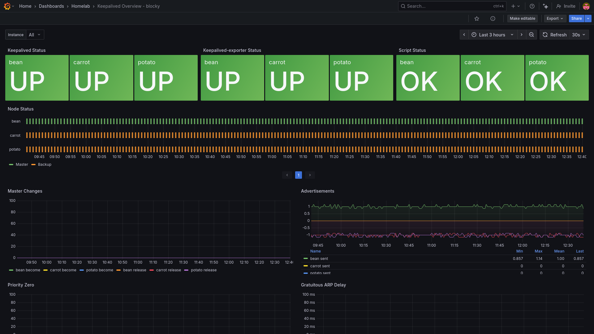

One of the main components in my homelab is an ad-blocking <abbr title="Domain Name System">DNS</abbr> proxy.

In addition to the blocking of ads – which already has the nice side-effect of
speeding up page loads on a lot of websites — such a service makes it easy to
define DNS entries specific to my <abbr title="Local Area Network">LAN</abbr>,
provides some local caching abilities and increases my visibility over what my
devices are doing.

As such, my goal is to make it the default DNS on my LAN for a network-wide
effect.

This implies that whatever DNS proxy I will be deploying needs to be
highly-available as a failing DNS server will effectively break everything else.

## Pi-hole vs Blocky

[Pi-hole](https://pi-hole.net/) is one of the most prominent projects when it
comes to providing a [DNS sinkhole](https://en.wikipedia.org/wiki/DNS_sinkhole).{}Fancy way of saying "_a DNS server that can block stuff_".{}

And with reason: it is a great project, stable and with a wide community.

However, Pi-hole comes with a fair amount of features that I do not need:

* a [web UI](https://github.com/pi-hole/web/) exposing some basic statistics and allowing to configure Pi-hole
* a DHCP server
* Pi-hole relies on a SQLIte3 database both for its long-term storage of query data and for its domain management
* …

More importantly, Pi-hole is configured via its UI or with API calls. I would
much rather prefer deploying a stateless server with a simple configuration file.

[Blocky](https://github.com/0xERR0R/blocky/) provides a leaner alternative that
focuses on proxying and blocking DNS requests, and is configured with a YAML file.

## Configuring blocky

I run blocky as a binary, deployed on three nodes with [ansible](https://github.com/K-Phoen/homelab/tree/main/ansible/roles/dns_server).{}Don't judge me: I'm far from knowing what I'm doing with ansible.{}

[Blocky's configuration](https://0xerr0r.github.io/blocky/latest/configuration/)
is pretty extensive.
Although what I use it for isn't very fancy:

* it uses a few different upstream DNS servers{}Those are needed since blocky can only block or proxy DNS requests. It is not an actual resolver and as such can not reply to requests on its own.{} that are more privacy-oriented than Google
* defines a few entries for machines on my LAN
* adds few lists to the _deny list_

```yaml
# https://0xerr0r.github.io/blocky/latest/configuration/

log:
  level: warn

ports:
  dns: 53

# All ze metrics please!
prometheus:
  enable: true
  path: /metrics

bootstrapDns:
  - upstream: tcp-tls:dns.mullvad.net
    ips:
      - 194.242.2.2
  - upstream: tcp-tls:dns0.eu
    ips:
      - 193.110.81.0
      - 185.253.5.0
  - upstream: tcp-tls:dns.quad9.net
    ips:
      - 9.9.9.9
      - 149.112.112.112
  - upstream: tcp-tls:unicast.uncensoreddns.org
    ips:
      - 89.233.43.71

upstreams:
  groups:
    default:
      # Quad9
      - tcp-tls:dns.quad9.net:853

      # Mullvad
      - tcp-tls:dns.mullvad.net:853

      # dns0.eu
      - tcp-tls:dns0.eu:853

      # https://blog.uncensoreddns.org/
      - tcp-tls:unicast.uncensoreddns.org:853

customDNS:
  mapping:
    beet.lab: 10.10.10.37
    bean.lab: 10.10.10.91
    carrot.lab: 10.10.10.64
    potato.lab: 10.10.10.122
    # …

caching:
  # Cache entries for a minimum of 5m
  minTime: 5m
  # Prefetch DNS results for often used queries (names queried more than 5 times in a 2 hour time window).
  prefetching: true
  # Maximum number of entries to prefetch.
  prefetchThreshold: 15

blocking:
  loading:
    # Start serving queries even if lists aren't fetched yet.
    strategy: fast
    # Refresh allow/deny lists once a day.
    refreshPeriod: 24h
    downloads:
      timeout: 15s
      attempts: 5
      cooldown: 15s # Time between the download attempts

  denylists:
    ads:
      - https://raw.githubusercontent.com/StevenBlack/hosts/master/hosts
    mixed:
      - https://cdn.jsdelivr.net/gh/hagezi/dns-blocklists@latest/wildcard/pro.txt # see https://github.com/hagezi/dns-blocklists?tab=readme-ov-file#ledger-multi-pro---extended-protection-recommended-
      - https://cdn.jsdelivr.net/gh/hagezi/dns-blocklists@latest/wildcard/popupads.txt # see https://github.com/hagezi/dns-blocklists?tab=readme-ov-file#tada-pop-up-ads---protects-against-annoying-and-malicious-pop-up-ads-
      - https://cdn.jsdelivr.net/gh/hagezi/dns-blocklists@latest/wildcard/native.tiktok.extended.txt # https://github.com/hagezi/dns-blocklists?tab=readme-ov-file#calling-native-tracker---broadband-tracker-of-devices-services-and-operating-systems- (tiktok)
    security:
      - https://cdn.jsdelivr.net/gh/hagezi/dns-blocklists@latest/wildcard/popupads.txt # see https://github.com/hagezi/dns-blocklists?tab=readme-ov-file#closed_lock_with_key-threat-intelligence-feeds---increases-security-significantly-recommended-
      - https://cdn.jsdelivr.net/gh/hagezi/dns-blocklists@latest/wildcard/hoster.txt # https://github.com/hagezi/dns-blocklists?tab=readme-ov-file#computer-badware-hoster-blocking---protects-against-the-malicious-use-of-free-host-services-

  clientGroupsBlock:
    default:
      - ads
      - mixed
      - security
```

And to test that blocky responds correctly:{}Replace `10.10.10.64` by the IP of your server{}

```sh
dig blog.kevingomez.fr @10.10.10.64
```

With blocky up and running, let's make it highly-available!

## High-availability with Keepalived

{}My LAN is fairly small, so load balancing of DNS requests isn't much of a concern.{}My objective is to make one of my three DNS servers available behind a
<abbr title="Virtual IP">VIP</abbr> and have an automatic failover in case of
failure.



To achieve this, I am using [Keepalived](https://keepalived.org/).

Keepalived is a daemon written in C and relies on the <a href="https://en.wikipedia.org/wiki/Virtual_Router_Redundancy_Protocol" title="Virtual Router Redundancy Protocol">VRRP</a>
protocol to provide high-availability and failover capabilities for IP-based
services.

VRRP lets us to define _virtual routers_: Each of those being an abstracted set
of nodes that will appear as a single machine on the network.

Nodes can be in one of two states:

* **Master**: node that handles traffic routed to the VIP
* **Backup**: node(s) ready to take over

To install Keepalived, look for a `keepalived` package for your distribution.

On Debian, you can run:

```sh
sudo apt install keepalived
```

The configuration is then done via the `/etc/keepalived/keepalived.conf` file.
Here is the one I use:

```tf
global_defs {
  # Don't run scripts configured to be run as root if any part of the path
  # is writable by a non-root user.
  enable_script_security
}

# This script will be used to determine whether blocky is running and responding.
# If not, a new master will be chosen.
vrrp_script blocky_responding {
  script   "/usr/bin/dig google.fr @127.0.0.1"
  timeout  2 # # seconds after which script is considered to have failed
  interval 3 # seconds between script invocations
  rise     5 # required number of successes for OK transition
  fall     2 # required number of successes for KO transition
  user     blocky blocky # user/group names to run script under
}

vrrp_instance blocky {
  # Initial state, MASTER|BACKUP
  # If the priority is 255, then the instance will transition immediately
  # to MASTER if state MASTER is specified; otherwise the instance will
  # wait between 3 and 4 advert intervals before it can transition,
  # depending on the priority.
  state BACKUP

  # interface for inside_network, bound by vrrp.
  interface eno1

  # arbitrary unique number from 1 to 255
  virtual_router_id 42

  # for electing MASTER, highest priority wins.
  # The valid range of values for priority is [1-255], with priority
  # 255 meaning "address owner".
  # To be MASTER, it is recommended to make this 50 more than on
  # other machines. All systems should have different priorities
  # in order to make behaviour deterministic.
  priority 100

  virtual_ipaddress {
    10.10.10.211 dev eno1
  }

  track_script {
    blocky_responding
  }
}
```

Once Keepalived is configured and running, we can check that DNS requests can
be resolved via the VIP:

```sh
dig blog.kevingomez.fr @10.10.10.211
```

And just to make sure, on the _master_ node, the VIP should be listed in the
network interface:

```shell {hl_lines="8"}
$ ip addr
...
2: enp0s31f6: <BROADCAST,MULTICAST,UP,LOWER_UP> mtu 1500 qdisc fq_codel state UP group default qlen 1000
    link/ether 6c:4b:90:82:18:5f brd ff:ff:ff:ff:ff:ff
    altname enx6c4b9082185f
    inet 10.10.10.91/24 brd 10.10.10.255 scope global dynamic enp0s31f6
       valid_lft 59780sec preferred_lft 59780sec
    inet 10.10.10.211/32 scope global proto 0x12 enp0s31f6
       valid_lft forever preferred_lft forever
    inet6 fe80::6e4b:90ff:fe82:185f/64 scope link proto kernel_ll
       valid_lft forever preferred_lft forever
```

**Note:** if a firewall is enabled on your nodes, make sure it lets multicast
traffic through.
For ufw, run `ufw allow in on eth0 from 10.10.10.1/24 to 224.0.0.18 comment 'keepalived multicast'`.

## Grafana monitoring

To keep an eye on what Keepalived is doing, I deployed
[keepalived-exporter](https://github.com/mehdy/keepalived-exporter).

Which allowed me to create this overview dashboard:{}Based on [the provided one](https://github.com/mehdy/keepalived-exporter/blob/8cf2a9003d118ea235639e3f05bd9d04d98bd18b/grafana/dashboards/keepalived-exporter.json).{}

[](./keepalived-blocky-overview.png)

**Bonus:** this dashboard was [generated from code](https://github.com/K-Phoen/homelab/blob/2d2599fc54da5ee672aef4a0688f8a57440edf4c/grafana/dashboards/keepalived/overview.go)
using the [Grafana Foundation SDK](https://github.com/grafana/grafana-foundation-sdk/).

## Unifi gateway

Manually configuring every device on my network to use blocky's DNS is a bit
tedious, so I configured my Unifi Cloud Gateway to advertise it as the DNS to
be used.{}This configuration can also be done per network instead of globally.{}

1. In the gateway's web UI, go to "**Settings**"
1. In the "**Internet**" tab, choose your **main WAN connection**
1. Ender "**Advanced**", uncheck "**DNS Server**" and set the VIP as "**Primary Server**"

## Tailscale

I then did the same for my Tailscale network by [setting the VIP as global nameserver](https://tailscale.com/kb/1054/dns#tailscale-dns-settings).

**Note:** the VIP being on a different subnet than Tailscale's network, a [subnet router](https://tailscale.com/kb/1019/subnets) is needed.

Using blocky's DNS through Tailscale allows me to block ads even on my phone, even when it's not connected to my home network \o/
