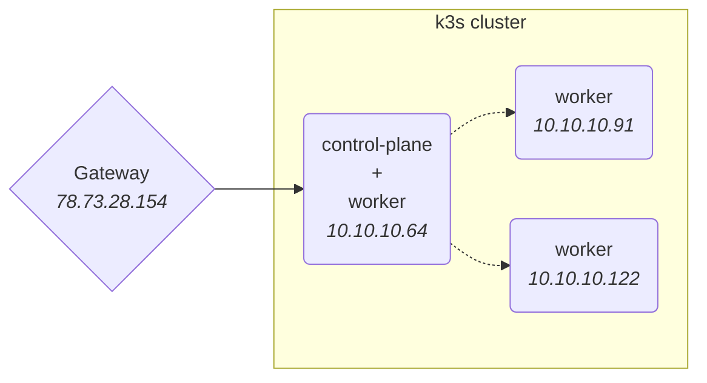
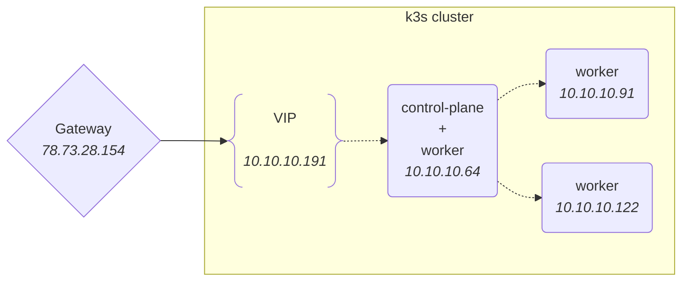

I setup my homelab a while ago, basically on a whim to have some fun with Kubernetes on cheap hardware, and hopefully learn something along the way.

As a result, I chose to deploy [k3s](https://docs.k3s.io/) in – _almost_ – its most straightforward form. {}Traefik is disabled to use a more recent version than what k3s shipped at the time.{}

A control-plane deployed with:

```shell
curl -sfL https://get.k3s.io | INSTALL_K3S_EXEC="--tls-san carrot.lab --disable traefik" sh -
```

And a couple of worker nodes deployed with:

```shell
curl -sfL https://get.k3s.io | K3S_URL=https://myserver:6443 K3S_TOKEN=mynodetoken sh -
```

With a DNS record pointing to my gateway's public IP and a bit of port-forwarding, I could host some services and expose them to the Internet.



Fast forward a while and it turns out that some of the services are used on a daily basis, and not just by me.
Nothing critical{}Think [Immich](https://immich.app/) and such.{} but I figured it was time to have a proper look at this setup and improve it.

One thing that bothered me is that all the traffic meant for my `type: LoadBalancer` services was forwarded from my gateway to a single node in the cluster, and then forwarded once more to the correct pod.

This is mainly due to [how ServiceLB works](https://docs.k3s.io/networking/networking-services#how-servicelb-works).

## ServiceLB

ServiceLB is the default load balancer implementation shipped with k3s. I am grossly over-simplifying, but basically it watches Kubernetes `Services` with the `spec.type` field set to `LoadBalancer`. For each of those `Services`, a `Daemonset` is created that in turn creates a `svclb-*` pod on each node.

{}This behavior is reminiscent of [`type: NodePort` services](https://kubernetes.io/docs/concepts/services-networking/service/#type-nodeport).{}As a result, instead of giving a dedicated IP/<abbr title="Virtual IP">VIP</abbr> like other `LoadBalancer` implementations would, these pods expose the desired port directly on the node via `hostPort`.

What all of this means is that if the node that my gateway forwards all the traffic to goes down, then all my services appear to be down.

Instead, I would like a load balancer implementation that exposes a <abbr title="Virtual IP">VIP</abbr> that my gateway can use, and handle the fail-over automatically when the node targeted by that VIP goes down.
I am mainly looking for high-availability, actual load balancing is not a requirement for me since the traffic I deal with is fairly small.

## MetalLB

disable Argo CD sync

delete existing `type: LoadBalancer` services



```sh
helm repo add metallb https://metallb.github.io/metallb
helm install metallb metallb/metallb
```

```yaml
apiVersion: argoproj.io/v1alpha1
kind: Application
metadata:
  name: metallb
  namespace: argocd
  finalizers:
    - resources-finalizer.argocd.argoproj.io
spec:
  project: default

  syncPolicy:
    automated:
      prune: true
      selfHeal: true
    syncOptions:
      - CreateNamespace=true
      - RespectIgnoreDifferences=true

  destination:
    namespace: metallb
    server: {{ .Values.spec.destination.server }}

  sources:
    - chart: metallb
      repoURL: https://metallb.github.io/metallb
      targetRevision: '0.15.2'
      helm:
        releaseName: metallb
        valueFiles:
          - $values/k8s/metallb/values.yaml
    - repoURL: {{ .Values.spec.source.repoURL }}
      targetRevision: {{ .Values.spec.source.targetRevision }}
      path: k8s/metallb
      ref: values
```

```yaml
apiVersion: metallb.io/v1beta1
kind: IPAddressPool
metadata:
  name: pool
spec:
  addresses:
    # make sure the DHCP server won't use that range
    - 10.10.10.191-10.10.10.210
```

```yaml
apiVersion: metallb.io/v1beta1
kind: L2Advertisement
metadata:
  name: l2-advertisement
spec:
  ipAddressPools:
    - pool
```

Bonus: Grafana dashboard as code: https://github.com/K-Phoen/homelab/blob/ff42696ebf6436bb646ce7d3c766866722f54c8f/grafana/dashboards/metallb/overview.go
