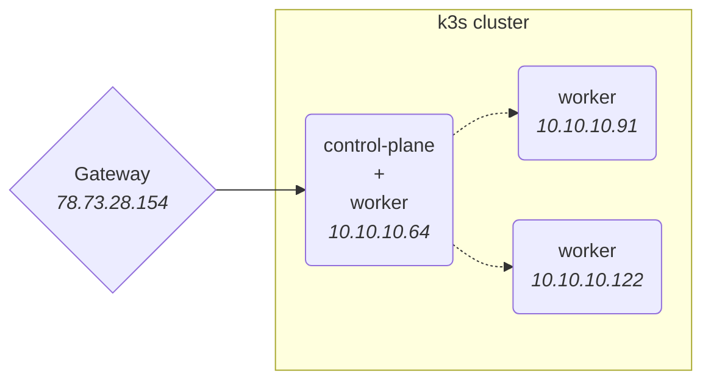
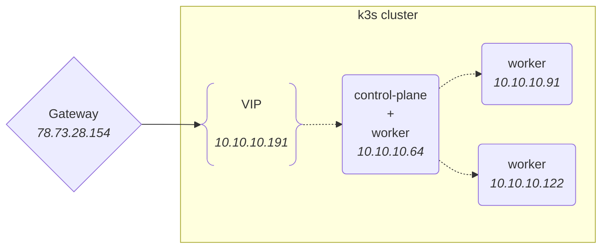
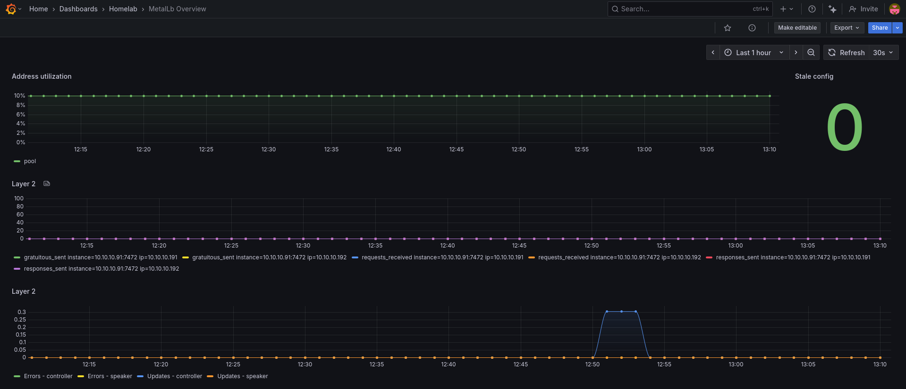

I setup my homelab a while ago, basically on a whim to have some fun with Kubernetes on cheap hardware, and hopefully learn something along the way.

As a result, I chose to deploy [k3s](https://docs.k3s.io/) in – _almost_ – its most straightforward form. {}Traefik is disabled to use a more recent version than what k3s shipped at the time.{}

A control-plane deployed with:

```shell
curl -sfL https://get.k3s.io | INSTALL_K3S_EXEC="--tls-san carrot.lab --disable traefik" sh -
```

And a couple of worker nodes deployed with:

```shell
curl -sfL https://get.k3s.io | K3S_URL=https://myserver:6443 K3S_TOKEN=mynodetoken sh -
```

With a DNS record pointing to my gateway's public IP and a bit of port-forwarding, I could host some services and expose them to the Internet.



Fast forward a while and it turns out that some of the services are used on a daily basis, and not just by me.
Nothing critical{}Think [Immich](https://immich.app/) and such.{} but I figured it was time to have a proper look at this setup and improve it.

One thing that bothered me is that all the traffic meant for my `type: LoadBalancer` services was forwarded from my gateway to a single node in the cluster, and then forwarded once more to the correct pod.

This is mainly due to [how ServiceLB works](https://docs.k3s.io/networking/networking-services#how-servicelb-works).

## ServiceLB

ServiceLB is the default load balancer implementation shipped with k3s. I am grossly over-simplifying, but basically it watches Kubernetes `Services` with the `spec.type` field set to `LoadBalancer`. For each of those `Services`, a `Daemonset` is created that in turn creates a `svclb-*` pod on each node.

{}This behavior is reminiscent of [`type: NodePort` services](https://kubernetes.io/docs/concepts/services-networking/service/#type-nodeport).{}As a result, instead of giving a dedicated IP/<abbr title="Virtual IP">VIP</abbr> like other `LoadBalancer` implementations would, these pods expose the desired port directly on the node via `hostPort`.

What all of this means is that if the node that my gateway forwards all the traffic to goes down, then all my services appear to be down.

Instead, I would like a load balancer implementation that exposes a <abbr title="Virtual IP">VIP</abbr> that my gateway can use, and handle the fail-over automatically when the node targeted by that VIP goes down.
I am mainly looking for high-availability, actual load balancing is not a requirement for me since the traffic I deal with is fairly small.

## An alternative: MetalLB

[MetalLB](https://metallb.io/) is a load-balancer implementation for bare metal Kubernetes clusters, using standard routing protocols.

When used in [layer 2 mode](https://metallb.io/concepts/layer2/), MetalLB elects a node to assume the responsibility of advertising{}Under the hood, MetalLB responds to [ARP](https://en.wikipedia.org/wiki/Address_Resolution_Protocol) requests for IPv4 services, and [NDP](https://en.wikipedia.org/wiki/Neighbor_Discovery_Protocol) requests for IPv6.{} a service to the local network. From the network's perspective, it looks like that machine has multiple IP addresses assigned to its network interface.

The major advantage of the layer 2 mode is its universality: it will work on any Ethernet network, with no special hardware required.

However, MetalLB does not implement an actual load balancer. Rather, it implements a failover mechanism so that a different node can take over should the current leader node fail for some reason.

When a failure occurs, failover is automatic: the failed node is detected using [memberlist](https://github.com/hashicorp/memberlist){}See also: [Clusters and membership: discovering the SWIM protocol](/2019/01/29/clusters-and-membership-discovering-the-swim-protocol/){}, at which point a new node take over ownership of the IP addresses from the failed node.

The leader node could bottleneck your service's ingress, and failover could be relatively slow.



## Installing MetalLB

As always, make sure you go through [the official installation guide](https://metallb.io/installation/) first.

{}If like me you are using [Argo CD](https://argo-cd.readthedocs.io/en/stable/) (or [Flux](https://fluxcd.io/) or other), don't forget to temporarily disable its automatic sync.{}Start by deleting existing `type: LoadBalancer` services, to ensure that no outdated routing configuration is left behind by ServiceLB.

ServiceLB can then be disabled by adding `--disable=servicelb` on the control-plane node and restarting k3s: `systemctl restart k3s.service`

MetalLB can now be installed via a Helm chart:

```sh
helm repo add metallb https://metallb.github.io/metallb
helm install metallb metallb/metallb
```

And here is how to use it with Argo CD:

```yaml
apiVersion: argoproj.io/v1alpha1
kind: Application
metadata:
  name: metallb
  namespace: argocd
  finalizers:
    - resources-finalizer.argocd.argoproj.io
spec:
  project: default

  syncPolicy:
    automated:
      prune: true
      selfHeal: true
    syncOptions:
      - CreateNamespace=true
      - RespectIgnoreDifferences=true

  destination:
    namespace: metallb
    server: {{ .Values.spec.destination.server }}

  sources:
    - chart: metallb
      repoURL: https://metallb.github.io/metallb
      targetRevision: '0.15.2'
      helm:
        releaseName: metallb
        valueFiles:
          - $values/k8s/metallb/values.yaml
    - repoURL: {{ .Values.spec.source.repoURL }}
      targetRevision: {{ .Values.spec.source.targetRevision }}
      path: k8s/metallb
      ref: values
```

I then created an [`IPAddressPool`](https://metallb.io/configuration/) to let MetalLB know the IP range{}Make sure your DHCP server won't allocate these IPs.{} that it could allocate to services:

```yaml
apiVersion: metallb.io/v1beta1
kind: IPAddressPool
metadata:
  name: pool
spec:
  addresses:
    # make sure the DHCP server won't use that range
    - 10.10.10.191-10.10.10.210
```

MetalLB now needs to be configured to advertise the addresses from this pool, which I chose to do over ARP/in layer 2 mode:{}MetalLB also supports [advertising IPs using BGP](https://metallb.io/concepts/bgp/).{}

```yaml
apiVersion: metallb.io/v1beta1
kind: L2Advertisement
metadata:
  name: l2-advertisement
spec:
  ipAddressPools:
    - pool
```

**Note:** remember to open port `7946` since MetalLB uses it for its memberlist.

## Monitoring MetalLB

MetalLB's helm chart provides a few ways of configuring how Prometheus should scrape its metrics.

I went with `PodMonitors`, and enabled them in my `values.yaml` file:

```yaml
prometheus:
  podMonitor:
    enabled: true
```

Which allowed me to create a simple overview dashboard:

[](./metallb-overview-dashboard.png)

Bonus: this dashboard was [generated as code](https://github.com/K-Phoen/homelab/blob/b29f8d10987f6c6d83d0d18f80dcfbdbab308260/grafana/dashboards/metallb/overview.go) using the [Grafana Foundation SDK](https://github.com/grafana/grafana-foundation-sdk/).
