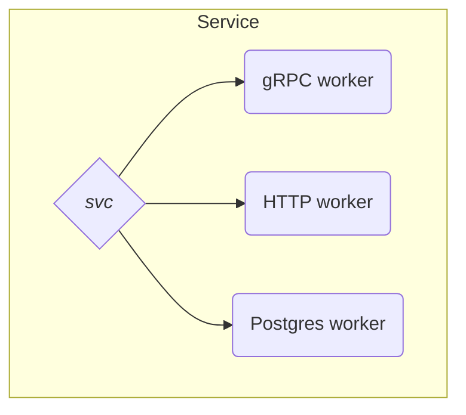
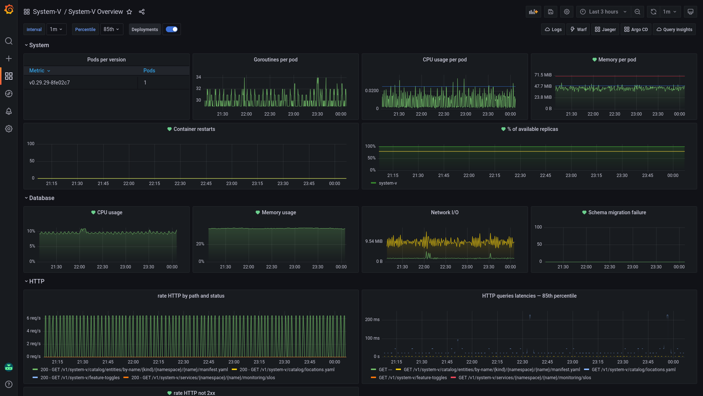

[Voi](https://www.voi.com/) in 2019 was a stimulating working environment.
The micro-mobility industry was in its infancy, evolving at a very fast pace, and so
was our product and platform.

The same couldn't be said about the state of our Grafana dashboards.

We did have Grafana and Prometheus running, but our microservices were poorly covered in
alerting and monitoring. Maybe even worse: the few existing dashboards were often incomplete
and looked completely different from one service to the next.

Overall, we had no confidence in our ability to observe the state of our systems,
and the heterogeneity of our dashboards was negatively impacting our ability to
understand them.

At this point, we were looking for ways to improve the situation on two key points:

* **coverage**: every service should have at least a default level of observability
* **cognitive load**: dashboards should look and feel consistent. Engineers should be
comfortable jumping between dashboards without having to re-learn everything.

But first, a bit of context.

## The wonders of standardization

Microservices at Voi have one small but important particularity: they are all
written in Go and based on [`svc`][svc].

Not exactly a framework, [`svc`][svc] can be seen as a very lightweight life-cycle
manager. It acts as the entry point of a service and manages *workers*.

A worker represents a long-running process, such as an HTTP or a gRPC server.



Having a collection of such workers allows for a high level of uniformity,
especially when it comes to the metrics they expose.

Because of [`svc`][svc] and its workers, we can rely on consistent metrics being
exposed:

* a service with a gRPC API will expose `grpc_server_handled_total`, `grpc_server_handling_seconds`, …
* a service with an HTTP API will expose `http_request_total`, `http_request_duration_seconds`, …
* and so on for other workers

## Dashboards as code with Grabana

Having known metrics consistently emitted by services is a huge advantage.

Our idea to make the most of it was simple: using these metrics, generate
a standard Grafana dashboard for every service in our platform.

This standard or "overview" dashboard will represent a service's
health and performance at a glance

Of course, services are slightly different from each other. Some only have an
HTTP server, others have only a gRPC one, some have both, …

We will need to account for these differences when building the dashboards.

Despite these differences, a common structure can be imagined:

* dashboards will be grouped by service, every service having a folder named
after it in Grafana
* dashboards will be named "*[service name] overview*"
* the dashboard's content will be organized in rows. One row for system metrics
and graphs, one for HTTP, one for gRPC, … If a row isn't relevant for a service,
it is dropped
* since these dashboards are generated, they will be read-only

Let's take as an example a service `system-v` that has a database and an HTTP
server. We would like to run the following command:

```console
voictl grafana setup-dashboard system-v \
    --with-http \
    --with-db
```

And get this result:



Assuming we can implement the `voictl grafana setup-dashboard` command, generating a dashboard
for each service in the platform becomes an entirely achievable goal.

But how do we implement it? Are there any libraries around to generate Grafana dashboards?

Three years ago, defining Grafana dashboards as code wasn't a hot topic at all. The choice of tools
was extremely reduced and nothing convinced us:

* [Grafonnet](https://github.com/grafana/grafonnet-lib): based on [Jsonnet](https://jsonnet.org/), it
meant asking Voi engineers to learn a new language, making contributions and adoption more difficult
* [`weaveworks/grafanalib`](https://github.com/weaveworks/grafanalib): seemed quite interesting, but no
one in our engineering community was proficient with Python (beyond short scripts)

**Enters [`grabana`][grabana]!**

As a response to this lack of open-source solutions, I decided to share my own.

[Grabana][grabana] is a Golang library that exposes a developer-friendly API to create Grafana dashboards.
Its stated goals are:

* providing an understandable abstraction over Grafana's internal representation of a dashboard
* expose a developer-friendly API
* allow IDE assistance and auto-completion

Thanks to [`grabana`][grabana], writing truly generic and re-usable Grafana dashboards becomes a breeze:

```go
builder := dashboard.New(
    "System-v overview",
    dashboard.AutoRefresh("1m"),
    dashboard.Tags([]string{"system-v", "generated"}),
    dashboard.VariableAsInterval(
        "interval",
        interval.Values([]string{"30s", "1m", "5m", "10m", "30m", "1h", "6h", "12h"}),
    ),
    dashboard.Row(
        "HTTP",
        row.WithGraph(
            "HTTP Rate",
            graph.WithPrometheusTarget(
                "sum(rate(http_request_total{app='system-v'}[$interval])) by (method, path, code)",
                prometheus.Legend("{{ code }} - {{ method }} {{ path }}"),
            ),
        ),
    ),
)

ctx := context.Background()
client := grabana.NewClient(
    &http.Client{},
    "http://grafana.local",
    grabana.WithAPIToken("such secret, much wow"),
)

// create the folder holding the dashboard for the service
folder, err := client.FindOrCreateFolder(ctx, "System-v")
if err != nil {
    fmt.Printf("Could not find or create folder: %s\n", err)
    os.Exit(1)
}

if _, err := client.UpsertDashboard(ctx, folder, builder); err != nil {
    fmt.Printf("Could not create dashboard: %s\n", err)
    os.Exit(1)
}
```

[`grabana`](https://github.com/K-Phoen/grabana) allowed us to go from a sporadic
coverage with highly heterogeneous dashboards, to having every service covered
by a standard, unified dashboard.

As a bonus, these dashboards also came with pre-defined alerts!

Almost overnight, our confidence in our monitoring and alerting saw a huge boost.

However, the best side effect was on the cognitive load associated to working with
these dashboards. Since they are highly standardized, the time invested in
understanding an overview dashboard for a service automatically transfers to the
overview dashboard for any other service!

## Custom dashboards as code with DARK

Standard dashboards are a good starting point, but there is only so much they
can show.

Service-specific dashboards are a must-have to gain any meaningful
confidence in the state of our platform. Each service should have dashboards
tailored to tell the story of some particular aspect of that service: how is
payment processing behaving? What's the state of our vehicle fleet? …

Teams have been creating this kind of dashboard manually. However, like any
manual work, this approach comes with a few downsides:

* creating and configuring dashboards in a UI is tedious, repetitive, and error-prone
* there is a huge drift in coverage and configuration depending on the environment
* close to no traceability on what changes are made to a dashboard and why
* no review/discussion is possible whenever a change is made
* the lifecycle of a service is separated from its dashboards. Releasing or
rolling back a service often results in out-of-date dashboards

To solve these issues, [`DARK`][dark] was born!

Based on [`grabana`][grabana], [`DARK`][dark] is a Kubernetes operator that
provides a way to provision dashboards, datasources, and Grafana API keys as code.

```yaml
apiVersion: k8s.kevingomez.fr/v1
kind: GrafanaDashboard
metadata:
  name: payments-business
  namespace: payments
  annotations:
    dark/folder: "Payments"
spec:
  title: Payments Business
  shared_crosshair: true
  tags: [generated, payments]
  auto_refresh: 1m

  variables:
    - interval:
        name: interval
        label: interval
        default: 1m
        values: [30s, 1m, 5m, 10m, 30m, 1h, 6h, 12h]

  rows:
    - name: Payment processing
      panels:
        - timeseries:
            title: Processing rate
            targets:
              - prometheus:
                  query: "sum(rate(payments_processing[$interval])) by (provider, status)"
                  legend: "{{ provider }} - {{ status }}"

        - graph:
            title: Failed payments
            targets:
              - prometheus:
                  query: "sum(rate(payments_processing{status='failed'}[$interval])) by (provider)"
                  legend: "{{ provider }}"
```

With [`DARK`][dark], Grafana dashboards are described
as Kubernetes manifests. As such, they follow the same process as the service
they observe:

* versioned in git
* reviewed in pull requests
* released and rolled back with the service they describe
* deployed in all the environments in which the service lives

And since not everyone is comfortable with writing YAML, a [converter](https://github.com/K-Phoen/dark/blob/master/docs/usage/converting-grafana-json-to-yaml.md)
is provided to ease the transition from existing, raw Grafana dashboards to
DARK ones.

## Developer experience

Seeing the benefits of declaring our custom dashboards as Kubernetes manifests
made us realize how painful it was to define "*standard dashboards*" using our
`voictl` tool.

```console
voictl grafana setup-dashboard system-v \
    --with-http \
    --with-db
```

One such command was required per service and per environment.
They were written in a simple bash script and executed in a Github Action,
whenever a change is made to that file.

This process was fine for some time... until it wasn't.

Maintaining the bash script became quite painful as the number of microservices
increased.

It was yet another manual step to perform when creating a new service.

And this script lived in a separate GitHub repository: far away from the
services or their Kubernetes manifests.

As a response, we decided to declare these standard dashboards as Kubernetes
manifests too!

These manifests are managed by an internal project: Dashung.

Instead of relying on a CLI tool and a quick'n'dirty bash script, we now have
a Kubernetes operator that manages manifests such as this one:

```yaml
apiVersion: voi.k8s.voiapp.io/v1
kind: DefaultDashboard
metadata:
  name: system-v
  namespace: system-v
spec:
  owner: developer-experience
  tier: 4

  http:
    enabled: true
    # Threshold rate for the "non-OK" alert.
    error_threshold: "1"

  db:
    name: "system-v"
```

Internally, Dashung uses [`grabana`][grabana] exactly like our CLI used to.

These dashboard manifests being close to the service itself, we could effortlessly
find and maintain them.

As a nice side effect, it allowed our [service scaffolding](https://backstage.io/docs/features/software-templates/)
to generate them automatically whenever new services are created.

And as an even nicer bonus, we defined additional types of standard dashboards:

* `BigTableDashboard`: to observe a [BigTable](https://cloud.google.com/bigtable) cluster
* `DataflowDashboard`: to observe [Dataflow](https://cloud.google.com/dataflow) jobs
* `ObservabilityDashboard`: to visualize observability-related metrics (how many
metrics is my service producing? What's their cardinality? How many logs? …)

Having services monitored by default and in a standard way was never easier.

## Looking back

The following quotes are taken from surveys sent out to our engineers:

> standard dashboards make my life insanely much easier for some things. Can never have enough of such tools

Or

> default dashboards makes it really clear

Our approach to standard dashboards is often mentioned positively whenever we ask
things like « What parts from your developer experience at Voi make you happy » or
« How easy is it to detect anomalies, find their root cause and fix them? »

It took us some time to find or build the tooling that we needed and piece
everything together in a coherent experience, but it was more than worth it.

Every service has monitoring and alerting by default. These dashboards being
described as code, their configuration can openly be discovered, updated or even
generated during service scaffolding.

It truly contributed positively to the engineers' experience, allowing them to
focus on solving business problems.

10/10 would do it again!

[svc]: https://github.com/voi-oss/svc
[grabana]: https://github.com/K-Phoen/grabana
[dark]: https://github.com/K-Phoen/dark
